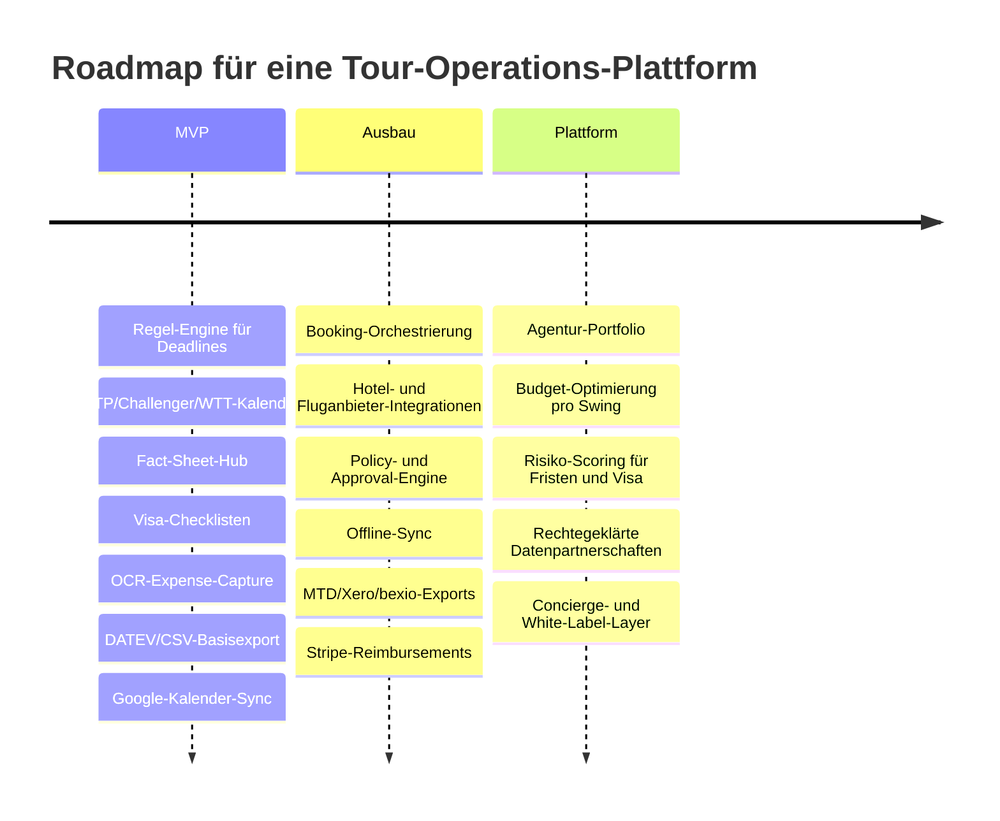

# Analytischer Bericht für eine Tour-Operations-Webapp im Profi-Tennis

## Executive Summary

Der stärkste Produktbedarf liegt nicht in einem weiteren einzelnen Kalender- oder Expense-Tool, sondern in einer **Operations-Plattform**, die drei heute getrennte Problemräume zusammenführt: **Turnier-Meldungen und Deadlines**, **Visa- und Reiseabwicklung** sowie **mehrwährungsfähige Ausgabenverwaltung mit steuerfähigem Export**. Die offiziellen Systeme decken jeweils nur Teilprozesse ab: ATP PlayerZone ist ein geschütztes Arbeitsportal für ATP-Spieler und Support-Teams; World Tennis Tour Zone ist das offizielle ITF/World-Tennis-Mitgliedssystem für Entries, Withdrawals und Schedule-Management; beide lösen aber weder End-to-End-Reisebuchung noch die kaufmännische Nachverarbeitung. Gleichzeitig adressieren Corporate-Travel- und Expense-Produkte wie TravelPerk, SAP Concur, Expensify oder Dext zwar Buchung, Richtlinien und Belegdigitalisierung, sind aber nicht auf die ATP-/Challenger-/ITF-Logik mit Freeze Deadlines, Alternates, Protected/Entry Ranking, Qualifying-Sign-in und „still competing“-Szenarien zugeschnitten. citeturn36search9turn36search18turn25search1turn25search7turn25search16turn25search6

Aus Produktperspektive ist der attraktivste Einstiegsmarkt **nicht der Top-ATP-Spieler mit ausgebautem Off-Court-Team**, sondern das Segment **Challenger-/ITF-Spieler, travelling coaches, kleine Akademien und Agenturen mit mehreren Klienten**. Der Grund ist operativ: Genau dort kumulieren hohe Reiseintensität, knappe Budgets, häufiger Länderwechsel und geringe Backoffice-Kapazität. Der operative Druck ist real, weil ATP und World Tennis sehr dichte, länderübergreifende Kalender fahren: Die ATP kommuniziert für 2026 einen Tourkalender mit 59 Turnieren in 29 Ländern zusätzlich zu den Grand Slams; die Men’s World Tennis Tour umfasst ungefähr 600 Turniere in 70 Ländern. Diese Breite erhöht die Zahl der Fristen, Visa-Fälle, Hotelwechsel und Währungsbrüche massiv. citeturn27search4turn9search13

In der Umsetzung sollte das Produkt als **mobile-first, offline-fähige Webapp mit Companion-App-Charakter** gedacht werden. Das MVP sollte **keine aggressive Vollautomatisierung offizieller ATP-/ITF-Meldungen ohne Rechteklärung** versprechen, sondern zunächst als **Decision Layer** funktionieren: offizielle Kalender und Fact Sheets einsammeln, Deadlines berechnen, Konflikte markieren, Visa-Fälle tracken, Reiseoptionen bündeln und Ausgaben in verwertbare Buchhaltungsexporte überführen. Der Grund für diese Zurückhaltung ist rechtlich und technisch belastbar: In den öffentlich zugänglichen ATP- und World-Tennis-Seiten sind Kalender, Regelwerke und Portale dokumentiert, aber eine allgemein zugängliche Entwickler-API ist dort nicht spezifiziert; zudem beansprucht World Tennis exklusive Data Rights für WTT-Turnierdaten und Scoring. citeturn33view2turn33view3turn33view4turn33view0

Die zentrale strategische Empfehlung lautet deshalb: **MVP als „Tour OS“**, nicht als „nur Buchung“ und nicht als „nur Expense“. Das Produkt sollte die offizielle Regel- und Deadline-Logik zuerst beherrschen, weil genau dort die teuersten Fehler entstehen: verpasste Entry- und Withdrawal-Deadlines, falsche Prioritäten, unvollständige Visa-Unterlagen, nicht signierte Alternates, falsch kategorisierte Reisekosten oder steuerlich unbrauchbare Belegsammlungen. Erst wenn dieser Kern steht, ist eine tiefere Booking- und Payment-Orchestrierung sinnvoll. citeturn39view0turn39view1turn16view1turn16view2turn35search0turn24search19turn35search2

## Turnier- und Meldeprozesse heute

Die offizielle Workflow-Realität auf ATP-, Challenger- und WTT-Ebene ist **regelbasiert, zeitzonenempfindlich und in mehreren Portalen fragmentiert**. Für ATP-Hauptfeld-Singles liegt die Main-Draw-Entry-Deadline bei ATP-Turnieren um **12:00 Uhr Eastern Time, 28 Tage vor dem Montag der Turnierwoche**; ATP-Tour-Qualifying läuft mit einer Deadline **21 Tage vorher**. Für ATP Challenger Tour Main Draw Singles gilt ebenfalls **12:00 Uhr Eastern Time, 21 Tage vor dem Montag der Turnierwoche**. Gleichzeitig müssen Entries und Withdrawals formal rechtzeitig über Player Relations, Supervisor oder PlayerZone eingehen, sonst gelten sie nicht als wirksam. citeturn37view0turn39view0

Bei Doubles wird es noch komplexer. Auf ATP Tour-Level gilt für Doubles Advance Entry **14 Tage vor Turnierbeginn, 12:00 Uhr ET**; die Withdrawal-Deadline liegt bei **10:00 Uhr ET am Freitag vor der Turnierwoche**, und die Online-On-Site-Entry öffnet am Freitag um **00:01 Uhr ET** und schließt um **15:00 Uhr ET**. Auf ATP Challenger-Ebene liegt die Doubles-Advance-Entry schon bei **7 Tagen vor Turnierbeginn**, Withdrawal wieder am **Freitag 10:00 Uhr ET**, während die On-Site-Doubles-Sign-in-Deadline üblicherweise **Samstag 12:00 Uhr Lokalzeit** ist. Zudem gelten für Challenger-Doubles tägliche Alternate-Sign-ins und Re-Pairing-Regeln, falls ein Partner ausfällt. citeturn5view1turn39view1

Auch das ATP-Qualifying ist prozessual heikel. Das Alternate Sign-In für ATP Tour Singles Qualifying beginnt grundsätzlich **spätestens um 16:00 Uhr** und schließt **um 18:00 Uhr Lokalzeit** am Abend vor dem Qualifying; zusätzlich gibt es am ersten Qualifying-Tag eine neue Alternate-Liste mit Deadline **30 Minuten vor dem ersten angesetzten Match**. Für Challenger-Qualifying gilt derselbe Grundmechanismus. Nach der Friday-Withdrawal-Deadline werden freie Plätze aus dem On-Site-Alternate-Sign-in besetzt. Das ist genau der Typ Logik, den Spieler ohne eigenes Operations-Tool regelmäßig manuell übersehen. citeturn39view1turn5view2

Auf World-Tennis-Tour-Ebene sind die Fristen anders, aber nicht weniger streng. In Singles liegt die Entry-Deadline bei **14:00 Uhr GMT am Donnerstag, 18 Tage vor dem Montag der Turnierwoche**; die Withdrawal-Deadline bei **14:00 Uhr GMT am Dienstag, 13 Tage vorher**; die Singles-Freeze-Deadline bei **14:00 Uhr GMT am Donnerstag vor der Turnierwoche**. Das Qualifying-Sign-in endet gewöhnlich **18:00 Uhr Lokalzeit am Vortag des Qualifyings**. Für Men’s-WTT-Doubles gilt: M25-Turniere nutzen Advance Entry mit Deadline **Dienstag, 6 Tage vor Turnierwoche, 14:00 Uhr GMT**; M15-Turniere arbeiten weiter mit On-Site-Doubles-Prozeduren. Die Tournament Fact Sheet enthält dabei explizit Hotel-, Transport- und Visa-Kontakte, was für ein Tour-Operations-Produkt hochrelevant ist. citeturn16view0turn16view1turn16view2turn16view3turn15view0

Protected Ranking bzw. Entry Protection ist ebenfalls ein Kernproblem. Nach ATP-Regelwerk kann ein Spieler, der **mindestens 6 Monate und weniger als 12 Monate** verletzt ausfällt, seine Entry Protection für die **ersten 9 Singles- und 9 Doubles-Turniere** oder maximal **9 Monate** nutzen; bei **12 Monaten oder länger** sind es **12 Singles- und 12 Doubles-Turniere** oder maximal **12 Monate**. Entry Protection gilt **für Entry und Special Exempt**, aber **nicht für Seeding oder Lucky-Loser-Ordnung**; sie muss **zum Zeitpunkt der Meldung** erklärt werden und verfällt, wenn sie nicht innerhalb von **3 Jahren** ab dem ursprünglichen letzten Event aktiviert wird. Es gibt außerdem eine dokumentierte Re-Injury-Freeze-Logik. citeturn6view4turn6view3turn6view5turn6view2turn5view2

Für die Produktkonzeption folgt daraus ein klares Datenmodell. Der fachliche Kern einer Webapp sollte mindestens die Objekte **Tournament**, **EventWeek**, **EntryIntent**, **AcceptanceState**, **PriorityOrder**, **ProtectedRankingClaim**, **WithdrawalAction**, **SignInWindow** und **FactSheetMetadata** enthalten. Ohne diese Normalisierung lässt sich weder ein Deadlines-Engine noch ein Konfliktprüfer sauber bauen. Ein Beispiel für interne API-Endpunkte wäre:

```http
GET /tour-events?source=atp|challenger|wtt&week=2026-W31
GET /entries/{playerId}/deadlines
POST /entries/{playerId}/priority-order
POST /entries/{playerId}/protected-ranking-claim
POST /withdrawals
GET /fact-sheets/{eventId}
```

Das ist ein **Vorschlag**, aber er folgt direkt aus der Regelarchitektur der offiziellen Quellen. citeturn39view0turn39view1turn16view0turn16view3

Der größte Painpoint heute ist, dass der Spieler oder Coach faktisch eine **manuelle Orchestrierungsebene** zwischen mehreren offiziellen und informellen Quellen leisten muss: PlayerZone oder Tour Zone, Fact Sheet, WhatsApp mit Coach/Agent, Hotel-Mailverkehr, Reiseseite und dann noch ein eigenes Spreadsheet. Die operative Konsequenz ist nicht nur Zeitverlust, sondern reales Fristenrisiko. Rechtlich heikel ist zusätzlich, dass World Tennis exklusive Data Rights an WTT-Daten beansprucht; daher sollte jede Produktstrategie für automatische Datenübernahme mit Terms-Prüfung, Partnervereinbarung oder nutzerseitigem Import arbeiten. Wo keine offizielle öffentliche API spezifiziert ist, sollte der Status transparent als **„nicht spezifiziert“** geführt werden. citeturn33view0turn36search9turn36search18

| Prozessbaustein | ATP / Challenger | World Tennis Tour |
|---|---|---|
| Main Draw Singles Entry | ATP Tour: 28 Tage vorher, 12:00 ET; Challenger: 21 Tage vorher, 12:00 ET. citeturn37view0 | 18 Tage vorher, Donnerstag 14:00 GMT. citeturn16view0 |
| Singles Withdrawal | ATP-Fristen formal über Entry-/Withdrawal-Regeln; operative Friday-Deadline ist für Vacancy- und Sanktionslogik zentral. citeturn39view0turn38view3 | Dienstag 13 Tage vorher, 14:00 GMT. citeturn16view0 |
| Freeze / Priority Lock | Nicht als „Freeze Deadline“ wie bei ITF spezifiziert; mehrere Acceptance- und Alternate-Mechaniken. citeturn39view1 | Donnerstag vor Turnierwoche, 14:00 GMT. citeturn16view2 |
| Qualifying Alternate Sign-in | ATP und Challenger: Vortag 16:00–18:00 lokal; zusätzlich 30 Minuten vor erstem Match am Spieltag. citeturn39view1 | Qualifying Sign-in bis 18:00 lokal am Vortag; Alternates müssen aktiv sign-in. citeturn16view1 |
| Doubles | ATP Tour Advance Entry 14 Tage, Challenger 7 Tage; Challenger On-Site meist Samstag 12:00 lokal. citeturn5view1 | M25 Advance Entry 6 Tage vorher; M15 on-site. citeturn16view3 |

## Visa und Einreise auf der Tour

Die Visa- und Einreiselogik auf der Herrentour folgt nicht einem einzigen Muster, sondern einer **Abfolge regionaler Regime**, die in kurzen Abständen wechseln. Für europäische Swings ist das Kernproblem für Nicht-EU-Spieler die Schengen-Regel: Im Schengen-Raum gelten einheitliche Visaregeln für Kurzaufenthalte von **maximal 90 Tagen innerhalb von 180 Tagen**. Die EU stellt dafür sogar einen offiziellen Short-Stay-Calculator bereit. Zusätzlich führt das Entry/Exit System die Registrierung von Namen, Reisedokumentdaten, Fingerabdrücken, Gesichtsbildern sowie Ein- und Ausreisezeitpunkten für Nicht-EU-Kurzaufenthalter an 29 europäischen Staaten automatisiert. Für Touring Athletes bedeutet das operativ: Schengen-Tage müssen nicht nur vor Saisonbeginn, sondern **swingweise und fortlaufend** geplant werden. citeturn28search4turn28search0turn29search4

Im Vereinigten Königreich ist der Prozess inzwischen zweistufig: Für viele visumfreie Kurzaufenthalte ist eine **ETA** nötig; sie kostet **£20** und erlaubt Kurzaufenthalte bis zu **6 Monaten** für bestimmte zulässige Besuchszwecke. Für eigentliche Visafälle gibt es – sofern die Kategorie und der Ort es zulassen – **Priority**- und **Super Priority**-Optionen; die britische Regierung nennt als Richtwert normalerweise **5 Arbeitstage** für Priority und **Entscheidung bis Ende des nächsten Arbeitstags** für Super Priority. Für eine Tour-App heißt das: ETA und Vollvisum dürfen nie im selben UI-Flow vermischt werden. citeturn28search1turn31search2

Für die USA ist die Lage für Profiathleten regelmäßig komplexer. Die offizielle P-1A-Kategorie richtet sich an **internationally recognized athletes**; zugleich betont das U.S. State Department, dass die Wartezeit auf Interviewtermine je nach Botschaft oder Konsulat von Woche zu Woche variieren kann und nur eine Schätzung ist. USCIS bietet Premium Processing für einschlägige I-129-Petitionen an, darunter auch für internationally recognized athletes. Praktisch heißt das: Ein sportlich „richtiger“ Visatyp löst das Engpassthema an der Konsularseite nicht automatisch. Genau deshalb braucht die App zwei separate Zeitachsen: **petition timeline** und **consular appointment timeline**. citeturn30search0turn30search1turn30search4

Kanada und Australien sind unterschiedlich. In Kanada wird eine eTA oft innerhalb von Minuten erteilt, kann aber mehrere Tage dauern; für Tätigkeiten, die über reine Einreise hinausgehen, verweist Kanada auf die separate Work-Permit-Systematik. Australien hat mit der **Temporary Activity Visa, Subclass 408, Sporting Activities stream** eine explizit sportspezifische Kategorie, die das Spielen, Coachen, Unterrichten oder Judging für ein australisches Team oder High-Level-Sporttraining mit einer Sportorganisation abdeckt. Das macht Australien administrativ klarer, aber nicht zwingend schneller. citeturn30search2turn28search3turn29search2

Japan zeigt exemplarisch, warum das Produkt eine **länderbezogene Dokumentlogik** braucht. Das Außenministerium verweist für Visa-Details auf die jeweils zuständige Mission; einzelne Missionen unterscheiden zudem sauber zwischen Temporary Visitor und visapflichtigen Fällen. Für eine Tour-App bedeutet das: Selbst wenn ein Land grundsätzlich „einfach“ wirkt, ist der operative Prozess oft missionsspezifisch. Eine zentrale Datenbank mit nur einem generischen „Japan-Flow“ wäre zu grob. In den ausgewerteten offiziellen Quellen ist eine einheitliche, sportspezifische nationale Regelung für alle Fälle **nicht spezifiziert**. citeturn29search5turn29search1

Beschleunigungs- und Serviceoptionen existieren, sind aber differenziert. VFS Global betreibt Tausende Visa-Antragszentren in zahlreichen Ländern und bietet Form-Filling, Premium Lounge, SMS und Kurieroptionen an; TLScontact bietet Premium-Lounge- und Zusatzdienste; CIBT positioniert sich als Corporate-Visa- und Document-Services-Anbieter für zeitkritische Reisefälle. Diese Anbieter ersetzen keine Rechtsprüfung, können aber in der Praxis die operative Last für Agenturen und Coaches deutlich senken. Eine Tour-App sollte solche Dienste deshalb **nicht als Kernfunktion**, sondern als **optionale Concierge-Partnerintegration** behandeln. citeturn30search7turn30search15turn31search0turn31search13

Die sinnvollste Umsetzung ist ein **Visa Case Management** pro Person und Land. Das Datenmodell sollte mindestens **CountryFlow**, **NationalityProfile**, **TravelPurpose**, **EntryWindow**, **RequiredDocs**, **EmbassyChannel**, **ServiceProvider**, **ProcessingEstimate**, **AppointmentState** und **RiskFlag** enthalten. Ein beispielhafter UI-Flow wäre:  
**Tourwoche wählen → geplante Länder erkennen → Nationalität und Reisezweck prüfen → erforderliche Unterlagen erzeugen → Fristen und Appointment-Risiko markieren → Eskalation an Servicepartner oder Agent**.  
Die größte rechtliche Hürde ist, dass Visa- und Einreiseberatung schnell in den Bereich regulierter Rechtsberatung hineinragen kann. Deshalb sollte die App immer mit dem Muster arbeiten: **offizielle Quelle, Dokumentencheckliste, Status-Tracking, Warnhinweis**, aber keine rechtsverbindliche Einzelfallzusage.

## Trainings- und Matchkalender

Aus sportwissenschaftlicher Sicht ist der Kalender im Profi-Tennis kein „nice to have“, sondern die Struktur, welche Training und Belastungssteuerung diktiert. Die Fachliteratur beschreibt den Profikalender als eng getaktet; die Wettkampfplanung bestimme die Periodisierung, mit ungefähr **30 Wettkampfwochen pro Jahr** und nur etwa **20 Wochen für Training und Recovery**. Gleichzeitig sind klassische Preseasons im Tennis meist nur **5 bis 7 Wochen** lang. Hinzu kommt, dass das intensive Wettkampfprogramm, die häufigen Reisen und unsicheren Spielarrangements progressive, strukturierte Trainingsplanung erschweren. citeturn19search10turn20search0turn20search3

Der organisatorische Schluss daraus ist eindeutig: Eine Tour-App darf Training nicht nur als „freien Kalendereintrag“ behandeln. Sie braucht ein Modell, das **Matchkalender, Reisebewegungen, Jetlag, Treatment, Court Availability, Sparring, Gym, Media und Recovery** zusammenführt. Genau darauf zielen moderne Athlete-Management-Systeme im Teamsport: Teamworks AMS zentralisiert Leistungs-, Medizin- und Kontextdaten; Kitman Labs beschreibt einen gemeinsamen Kalender für Training, Travel, Meetings und statusbezogene Verfügbarkeit; CoachNow Academy verbindet Coaching, Scheduling, Facility Calendar und Billing. Der Markt zeigt also klar, dass Scheduling allein nicht reicht – entscheidend ist die Verknüpfung mit Athletenkontext und Rollen. citeturn40search16turn26search9turn40search9

Die Painpoints im Tennis sind jedoch nochmals spezieller als im Teamsport. Coaches priorisieren häufig on-court, integrierte, skill-basierte Sessions; zugleich ist die Quantifizierung interner und externer Trainingslast essenziell, aber externe Load-Technologie in Tennisumfeldern oft teuer und unpraktisch. Daraus folgt für ein Tennissystem: Es sollte mit **einfachen, robusten Signalen** beginnen – Sessiontyp, Dauer, subjective RPE, surface, city, travel time, available court, coach present, physio present – bevor komplexe Sensorik integriert wird. citeturn20search15turn20search13

Technisch ist die Integrationslage für Kalender gut. Die Google Calendar API unterstützt eine REST-Schnittstelle, Push Notifications und inkrementelle Synchronisation per Sync-Token; wenn ein Sync-Token ungültig wird, muss der Client laut Doku einen Full Sync fahren. Apple-Kalender lassen sich über CalDAV anbinden. Für Offline-Funktionalität ist Workbox Background Sync ein belastbarer Baustein, weil fehlgeschlagene Requests später erneut zugestellt werden können. Für Tour-Arbeit ist genau das wichtig: ein Coach im Flughafen-WLAN oder ein Spieler ohne stabile Verbindung muss Eingaben zu Training, Check-in oder Receipt später zuverlässig synchronisieren können. citeturn22search5turn22search0turn22search1turn22search8turn22search2turn22search3turn22search14

Produktseitig empfehle ich für den Kalender vier Ebenen: **Official**, **Travel**, **Performance**, **Private**.  
Official enthält ATP-/WTT-Eventdaten, Deadlines, Qualifying-Fenster und Fact Sheets. Travel enthält Flug, Hotel, Ground Transport und Visa-Stati. Performance enthält Training, Match, Treatment und Load. Private enthält persönliche Termine. Die entscheidende UX-Regel: **Official-Ereignisse müssen „read-only + override by note“ sein**, während Performance-Ereignisse **collaborative edit** unterstützen. So verhindert man, dass operative Nutzer offizielle Fristen „wegeditieren“.

Ein praktikabler interner API-Ansatz wäre:

```http
GET /calendar/feed?layer=official,travel,performance
POST /calendar/events
POST /calendar/google/watch
POST /calendar/google/sync
POST /calendar/apple/caldav-link
POST /training-load
GET /availability?playerId=...
```

Das ist wiederum ein Vorschlag. Er ist aber stringent aus den Quellen ableitbar: belastbare Sync-Mechanik bei Google, CalDAV auf Apple-Seite und die sportliche Notwendigkeit, Planung, Kommunikation und Execution zwischen Coach, S&C und Athlet zu triangulieren. citeturn22search0turn22search1turn22search2turn20search13

## Marktlandschaft der Tools

Die aktuelle Marktlandschaft ist fragmentiert in **offizielle Entry-Portale**, **Athlete-Management-/Coaching-Software** und **Travel-/Expense-Stacks**. Genau diese Fragmentierung erzeugt die Produktchance. Im Folgenden eine verdichtete Vergleichsanalyse.

| Name | Zielgruppe | Relevante Funktionen | API / Export | Preis | Schwächen |
|---|---|---|---|---|---|
| ATP PlayerZone | ATP-Spieler, Support-Teams | Zentrale ATP-Arbeitsplattform; passwortgeschützt; für geschäftliche Abläufe auf der Tour. citeturn36search9turn36search10 | öffentlich nicht spezifiziert | nicht spezifiziert | Nicht öffentlich, keine offen dokumentierte Integrationsschicht in den ausgewerteten Quellen. |
| World Tennis Tour Zone | ITF/World-Tennis-Spieler | Entries, Withdrawals, Calendar, Acceptance Lists, player resources; 24/7 verfügbar. citeturn36search1turn9search15 | öffentlich nicht spezifiziert | Professional Membership USD 90. citeturn36search18 | Stark auf offizielle Entry-Prozesse fokussiert, keine integrierte End-to-End-Reise- oder Expense-Logik. |
| CoachNow Academy | Coaches, Akademien, Multi-Coach-Umfelder | Videoanalyse, Kommunikation, Scheduling, Facility Calendar, Billing, Automations. citeturn40search9turn40search11 | Third-party Integrations genannt; Details nicht spezifiziert. citeturn40search0 | ab USD 899/Jahr bzw. USD 89.99/Monat für den Academy-Kontext. citeturn40search0 | Tennis-spezifische Tour-Deadlines, Visa und Entry-States fehlen. |
| Teamworks Hub / AMS | Elite-Sportorganisationen | Kommunikation, Scheduling, Operations; AMS für personalisierte, koordinierte Betreuung und zentralisierte Daten. citeturn40search1turn40search16 | nicht öffentlich spezifiziert | nicht spezifiziert | Für Einzelspieler-Touren oft zu organisationszentriert; Pricing und Setup typischerweise Enterprise. |
| Kitman Labs iP | Profiteams, Verbände, Leistungsorganisationen | Zentraler Kalender für Training, Travel, Meetings; workflowbasierte Zusammenarbeit; API als Add-on. citeturn26search9turn26search13 | API als Add-on, Scope-/Preis-abhängig. citeturn26search13 | nicht spezifiziert | Starker Team-/Institutionen-Fokus; weniger natürliche Passung für nomadische Einzelspieler- und Coach-Touren. |
| TravelPerk | Business Travel / Spend | Buchen und managen von Reisen, Änderungen, automatische Expense-Erfassung und Policy-Breach-Erkennung. citeturn25search7 | Integrationen vorhanden; Details auf der Preis-/Produktseite teilweise implizit. citeturn25search3 | Travel buchungsbasiert; Spend pro aktivem Nutzer. citeturn25search3 | Nicht auf ATP-/ITF-Melde- und Protected-Ranking-Logik ausgelegt. |
| Expensify | Einzelnutzer, kleine Teams, Unternehmen | SmartScan, automatische Expense-Erstellung, Travel Booking, Reimbursements; CSV/Spreadsheet-Export. citeturn25search4turn25search16turn25search12 | CSV/Spreadsheet; weitere Integrationen je Workspace. citeturn25search12 | Individuell kostenlos; Unternehmen ab USD 5/Member. citeturn25search0turn25search8 | Starker Finance-Fit, aber keine Tour-Regel-Engine. |
| SAP Concur | Mittelstand / Enterprise | Receipt Capture, Auto-Kategorisierung, Policy-Updates, Anbindung an Finanzsysteme. citeturn25search1turn25search5turn25search9 | Finanzsystem-Anbindung ja; öffentliche API-/Preisdaten in den ausgewerteten Quellen nicht spezifiziert | nicht spezifiziert | Enterprise-lastig; für kleine Coach-/Agenturstrukturen oft zu schwergewichtig. |
| Dext | SMB/Bookkeeping | Scan von Receipts/Invoices, automatische Kategorisierung, Sync mit Buchhaltungssoftware, Offline Capture. citeturn25search6turn25search10 | Sync mit Accounting Software. citeturn25search18 | ab ca. USD 25.21/Monat auf Business-Preisseite. citeturn25search14 | Starke Backoffice-Automation, aber keine Reise-/Tournament-Operations. |

Die Marktlogik ist klar: **Kein Produkt in dieser Tabelle schließt gleichzeitig die offizielle Tennis-Operations-Ebene, Mobility/Visa und steuerfähige Mehrwährungs-Expense-Verarbeitung**. ATP PlayerZone und Tour Zone sind die nächstliegenden Systeme, aber sie sind bewusst Tour-spezifische Arbeitsportale und keine vollständigen Travel/Finance-Plattformen. Umgekehrt sind TravelPerk, Expensify, Concur und Dext operativ mächtig, aber sportregel-blind. Diese „Lücke zwischen Vertikale und Horizontalsoftware“ ist der eigentliche Investitionscase. citeturn36search9turn36search18turn25search7turn25search16turn25search1turn25search6

## Finanzen, Ausgaben und Steuerexport

Der Finanzteil ist für eine Tour-App kein Add-on, sondern ein zweiter Produktkern. Der Grund ist regulatorisch und operativ. In Deutschland gelten die GoBD als Maßstab für ordnungsmäßige elektronische Führung und Aufbewahrung von Büchern, Aufzeichnungen und Unterlagen; DATEV stellt standardisierte Dateiformate wie EXTF/DATEV-CSV sowie Buchungsdaten- und Dokumentenservices bereit. Für das Vereinigte Königreich gilt seit **6. April 2026** für bestimmte Einkommensschwellen Making Tax Digital for Income Tax; dafür müssen digitale Aufzeichnungen geführt und über kompatible Software eingereicht werden. In den USA erklärt IRS Publication 463, welche Travel-, Gift- und Car Expenses abziehbar sind und welche Nachweise erforderlich sind. In der Schweiz läuft die Mehrwertsteuerabrechnung online über das ESTV-Portal; die ESTV verweist auch auf ihre Fremdwährungskurse für die Umrechnung. citeturn35search0turn24search4turn24search8turn24search19turn24search11turn35search2turn35search6turn35search5turn35search21

Für die eigentliche Produktlogik bedeutet das: Eine Tour-App sollte **nicht primär versuchen, Steuern selbst zu berechnen**, sondern **steuerfähige, juristisch robuste Datenpakete** exportieren. Für Deutschland ist das Zielbild ein **DATEV-kompatibler Export** mit Buchungssätzen und Belegverknüpfung. Für UK ist das Zielbild ein **MTD-kompatibler, digitaler Records-Export** an die verwendete Steuersoftware. Für die USA sollte der Export IRS-typische Kategorien und Belegnachweise so strukturieren, dass Accountant- oder Tax-Prep-Workflows beschleunigt werden. Für die Schweiz ist ein landesweit einheitliches, öffentlich dokumentiertes Tour-Expense-Exportformat in den ausgewerteten offiziellen Quellen **nicht spezifiziert**; praxistauglicher ist daher ein Set aus **CSV/Belegarchiv/MWST-ready Reports** für bexio, Abacus oder Treuhand-Workflows. citeturn24search4turn24search16turn24search19turn35search2turn35search5

Die Markttools zeigen, welche Funktionen Nutzer erwarten. Expensify bietet Receipt Scan, automatische Expense-Erstellung, Travel Booking und CSV/Spreadsheet-Export; SAP Concur digitalisiert Receipts, kategorisiert und itemisiert sogar komplexe Hotelbelege und verbindet sich mit Finanzsystemen; Dext scannt Belege, kategorisiert automatisch und synchronisiert in Buchhaltungssoftware; Xero und bexio unterstützen Mehrwährungsfälle. Daraus folgt für das Zielprodukt, dass es mindestens fünf Automatisierungsstufen geben sollte: **OCR-Erfassung**, **Merchant-Normalisierung**, **Kategorisierung**, **Policy-Prüfung**, **Export-Mapping**. citeturn25search4turn25search12turn25search5turn25search9turn25search6turn25search18turn24search1turn24search2turn24search6

Fachlich empfehle ich ein Expense-Datenmodell mit **Expense**, **ReceiptImage**, **Merchant**, **CurrencyAmount**, **FXRateSource**, **TripLink**, **TaxTreatment**, **ApprovalState**, **ReimbursableFlag**, **PolicyViolation**, **ExportMapping**.  
Der entscheidende Clou für Tennis ist die direkte Verknüpfung der Ausgabe mit der Tourlogik:  
Ein Hotelbeleg sollte nicht nur Kategorie „Lodging“ tragen, sondern zugleich mit **Tournament Week**, **Coach-/Player-Zuordnung**, **visa case**, **city**, **surface block**, **shared room flag** und **booking source** verknüpft werden. Erst dadurch lassen sich Budgets pro Swing, pro Spieler, pro Coach und pro Agentur sauber auswerten.

Ein beispielhafter API-Satz wäre:

```http
POST /expenses/scan
POST /expenses/{id}/classify
POST /expenses/{id}/attach-to-trip
POST /policies/evaluate
POST /exports/datev
POST /exports/xero
POST /exports/uk-mtd-package
POST /exports/us-tax-bundle
```

Auch dies ist ein Vorschlag. Unterstützt wird er aber durch die reale Integrationslandschaft: DATEV standardisiert File-Formate, Xero und bexio arbeiten mit Multicurrency, HMRC verlangt digitale Aufzeichnungen, und IRS Publication 463 verlangt substantiierte Nachweise. citeturn24search4turn24search16turn24search2turn24search6turn24search1turn24search19turn35search2

Die größten Risiken liegen in drei Punkten. Erstens: **lokale Beleg- und Aufbewahrungsregeln**; gerade bei digitalisierten Receipts verweisen Anbieter wie SAP Concur selbst darauf, dass lokale steuerliche und gesetzliche Anforderungen zu beachten sind. Zweitens: **Mischfälle privat/geschäftlich**, etwa verlängerte Hotelnächte oder Reiseketten mit privatem Anschluss. Drittens: **multi-entity reimbursement**, wenn ein Coach für mehrere Spieler vorstreckt oder eine Agentur Kosten weiterbelastet. Genau hier braucht das Produkt einen strengen Approval- und Audit-Trail. citeturn25search9turn25search13

| Zielland | Praktischer Exportstandard | Warum wichtig |
|---|---|---|
| Deutschland | DATEV-Format / Buchungsdatenservice / Beleglinking. citeturn24search4turn24search8turn24search16 | Steuerberater- und Kanzlei-Workflows sind stark DATEV-zentriert. |
| Schweiz | MWST-ready CSV + Belegarchiv; national einheitlicher Tour-Expense-Standard in offiziellen Quellen nicht spezifiziert. citeturn35search5turn35search21 | Hoher Anteil grenzüberschreitender Reisen, Fremdwährungsumrechnung wichtig. |
| USA | IRS-geeigneter Travel/Expense-Nachweisbundle gemäß Publication 463. citeturn35search2turn35search6 | Dokumentationsanforderungen und Business-purpose-Nachweise sind zentral. |
| Vereinigtes Königreich | MTD-kompatible digitale Records / Quarterly-Update-ready Export. citeturn24search19turn24search11 | Digitale Aufzeichnungspflicht und softwaregestützte Einreichung. |

## Zielarchitektur, UX und Datenschutz

Die technische Architektur sollte als **event-driven, integration-heavy, offline-first SaaS** gedacht werden. Auf der Ingest-Seite stehen offizielle Kalender, Fact Sheets und Portale; auf der Orchestrierungsseite Regel-Engine, Workflow-Engine und Policy-Engine; auf der Action-Seite Kalender-Sync, Buchung, Belegerfassung, Payment und Exporte. Dabei ist die wichtigste Architekturentscheidung nicht „Monolith oder Microservices“, sondern **ob die App System of Record oder System of Orchestration sein soll**. Für den Start ist Orchestration überlegen, weil die offiziellen Toursysteme bereits autoritative Daten für Entries und Acceptance States führen. citeturn36search18turn36search9turn33view0

Ein belastbares Integrationsraster ist technisch vorhanden. Für Google Calendar gibt es REST, Push-Notifications und inkrementelle Synchronisation; für Apple funktionieren CalDAV und Sign in with Apple; Stripe liefert Webhooks und Connect-spezifische Webhooks; Booking.com bietet Demand API, Reservations API und ein Notification-Service-Modell mit Webhook-Endpoints; Amadeus und Duffel stellen Flight- und Travel-APIs bereit. Das genügt vollständig, um eine produktionsfähige Integrationsschicht zu bauen. citeturn22search0turn22search1turn22search2turn34search3turn34search7turn34search0turn34search20turn23search4turn34search1turn34search13turn23search1turn23search5turn23search21turn23search2turn23search10

Problematisch ist nur die offizielle Tennis-Datenlage. ATP- und World-Tennis-Seiten dokumentieren Rulebooks, Kalender und Portale, aber in den analysierten öffentlich zugänglichen Quellen keine allgemein verfügbare Developer-API; bei World Tennis kommen zusätzlich explizite Data-Rights-Regeln hinzu. Deshalb sollte die Architektur eine **Source Adapter Layer** enthalten, in der jede Quelle mit einem Compliance-Status versehen wird: **official API**, **official portal**, **licensed feed**, **user import**, **manual entry**. Alles andere ist aus rechtlicher Sicht unnötig riskant. citeturn33view0turn33view2turn33view3turn33view4

Aus UX-Sicht sollte das Produkt streng **rollenbasiert** sein:  
**Spieler** brauchen Überblick, Deadlines, Visa-Status, Q-Sign-in und einfache Expense-Capture.  
**Coaches** brauchen Kalenderkoordination, Travel-Sync, Training Blocks, Treatment und Team-Chat.  
**Agenturen/Manager** brauchen Portfolio-Views, Budgetübersichten, Visa-Pipeline und Buchhaltungs-/Exportansicht.  
Diese Rollen leiten sich direkt aus den real existierenden Portalen und Enterprise-Tools ab, die jeweils unterschiedliche Perspektiven auf dieselben Bewegungen legen. citeturn36search9turn36search18turn40search1turn26search9

Datenschutz ist kein Nebenthema. Unter EU-Recht gelten Gesundheitsdaten sowie biometrische Daten, wenn sie zur Identifikation dienen, als sensitive/special-category data. Wenn eine Tour-App also Availability, Injury Status, Physio-Notizen, biometrische Pass-/Visa-Daten oder Reisedokumente speichert, ist sie unmittelbar in einem hochsensiblen Datenschutzbereich. Auch das schweizerische Datenschutzrecht und die Aufsicht des FDPIC machen deutlich, dass Datenbearbeitung und Datensicherheit zentral sind. Daraus folgt: **DPIA vor Go-Live**, **Verschlüsselung at rest und in transit**, **strikte Rollen- und Feldrechte**, **minimale Scopes**, **kurzlebige Tokens** und **PKCE-/OAuth-Best-Practice** sind Pflicht, nicht Kür. citeturn32search0turn32search12turn32search1turn32search5turn32search7turn32search2turn32search6

Konkret würde ich folgende Architektur empfehlen:

```text
Client Apps
  -> PWA + mobile wrappers
  -> offline queue + encrypted local cache

Core Services
  -> tournament-rule-engine
  -> calendar-orchestrator
  -> visa-case-service
  -> booking-broker
  -> expense-ledger
  -> export-service
  -> notification-service

Integration Layer
  -> Google Calendar
  -> Apple CalDAV / Sign in with Apple
  -> Stripe Connect
  -> Booking / Amadeus / Duffel
  -> ATP/World Tennis adapters
  -> accounting adapters (DATEV/Xero/bexio/... )

Data Layer
  -> relational core
  -> document storage for receipts/visa docs
  -> audit log
  -> permissions graph
```

Die UX-Regel hierzu ist schlicht: **Ein Tap für Capture, zwei Taps für Bestätigung, keine Pflichtfelder mitten im Transit**, aber alle fehlenden Pflichtdaten asynchron nachforderbar. Das ist auf Tour entscheidend.

## Priorisierte Produktstrategie und Go-to-Market

Die richtige Priorisierung ist sequenziell. Das MVP sollte zuerst die **Regel- und Fristenkompetenz** abdecken, weil das der Bereich ist, in dem Fehler den höchsten operativen und finanziellen Schaden stiften. Erst danach kommen tiefere Booking- und Finanzautomatisierung. Ich würde daher wie folgt priorisieren:

**MVP**  
Ein offizieller Kalender- und Deadline-Layer für ATP/Challenger/WTT, Fact-Sheet-Sammlung, Turnier-Priorisierung, Acceptance-/Alternate-Status, Visa-Checklisten, Teamkalender, Expense-Capture mit OCR, Mehrwährung, einfache Kategorien, CSV-/DATEV-Basisexporte, Google-Kalender-Sync und Push-Benachrichtigungen. Diese Kombination trifft die größten Schmerzen mit vergleichsweise geringem rechtlichen Risiko. citeturn39view1turn16view0turn15view0turn24search4turn22search0turn22search1

**Sechs bis zwölf Monate**  
Nächster Ausbau auf Booking-Orchestrierung über Booking.com, Amadeus oder Duffel, Richtlinien-Engine für Agenturen, Approval-Flows, automatisches Matching von Reisedaten zu Turnierwochen, MTD-/Xero-/beXio-Exporte, Offline-Queue und Connect-Webhooks für Zahlungen und Erstattungen. Hier entsteht der erste echte Workflow-Compounding-Effekt. citeturn23search4turn34search1turn23search13turn23search10turn34search20turn34search16turn24search11turn24search1turn24search2

**Zwei Jahre**  
Erst dann lohnt sich die volle Plattformtiefe: Budgetoptimierung pro Swing, Preis-/Frist-Risiko-Scoring, agenturweites Portfolio-Management, Concierge-Layer für Visa-Services, dokumentierte Partnerfeeds mit offizieller Rechtebasis, sowie vorausschauende Empfehlungen wie „Schengen-Risikowarnung“, „zu enger Reiseplan vor Qualifying-Sign-in“ oder „steuerlich problematische Mischkosten“. Diese Ebene ist daten- und vertrauensintensiv; sie braucht zuerst einen soliden operativen Kern.



Beim Monetarisierungsmodell spricht vieles für einen **hybriden Aufbau**. Reine Seat-Pricing-Modelle sind im Profi-Tennis oft zu klein, reine Booking-Commission-Modelle zu volatil. Besser ist eine Kombination aus **SaaS-Grundgebühr**, **Agentur-/Team-Workspace-Preisen**, **Transaktionsumsatz bei Reisebuchungen**, **Premium-Visa-Concierge-Referral** und **Premium-Exports/Compliance Packs**. Die Benchmark am Markt ist brauchbar: World Tennis Tour Zone kostet USD 90 jährlich; Expensify startet bei USD 5 pro Member; TravelPerk rechnet Reisen buchungsbasiert und Spend pro aktivem Nutzer; CoachNow Academy liegt im Bereich von knapp USD 900 pro Jahr oder rund USD 90 pro Monat. Ein tennis-spezifisches Produkt könnte daher plausibel mit einer **niedrigen Player-Tier**, einer **Coach/Team-Tier** und einer **Agency-Tier** arbeiten. Das ist ein Vorschlag, aber er stützt sich auf die real existierenden Preissignale. citeturn36search18turn25search0turn25search8turn25search3turn40search0

Der sinnvollste Go-to-Market ist **B2B2C über Coaches, travelling physios, kleine Akademien und Boutique-Agenturen**, nicht direkt nur an Einzelspieler. Dieses Segment hat den höchsten Koordinationsschmerz und bringt mehrere Seats pro Verkauf. Auf Produktebene sollte das Messaging nicht „Wir sind ein Reiseportal für Tennisspieler“ lauten, sondern **„Wir verhindern Fristfehler, reduzieren Reisestress und machen Ausgaben buchhaltungsfähig“**. Genau dort ist der operative ROI am klarsten. Auf späterer Stufe kann ein White-Label- oder Federation-Ansatz folgen, aber nur, wenn Rechte- und Datenschutzfragen sauber gelöst sind.

Unterm Strich ist die Produktchance substanziell, aber nur dann, wenn die App **regelgenau, compliance-fähig und operationszentriert** gebaut wird. Wer zuerst „Booking“ verkauft, baut am Kernproblem vorbei. Wer zuerst „Tour Rules + Visa + Expense Ledger“ löst, hat die realistisch beste Chance, im ATP-/Challenger-/ITF-Ökosystem ein dauerhaftes System of Action zu werden. citeturn39view0turn39view1turn16view0turn35search0turn24search19