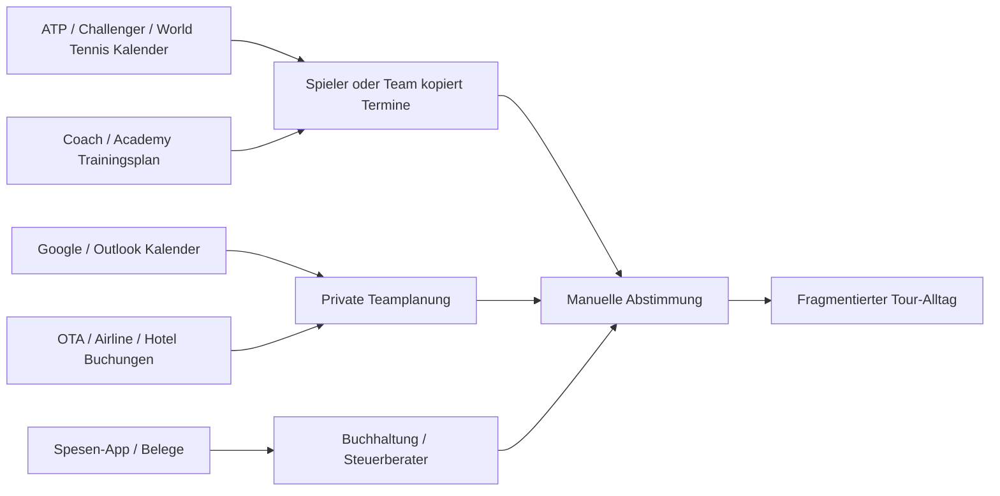
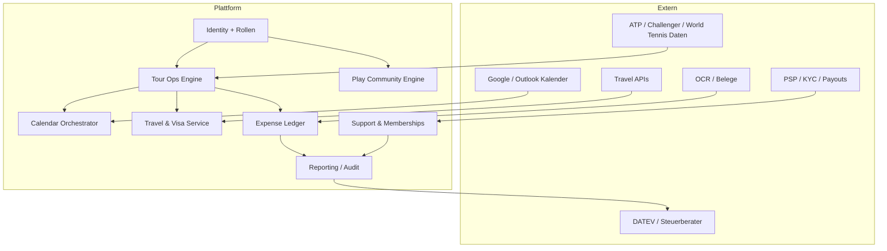
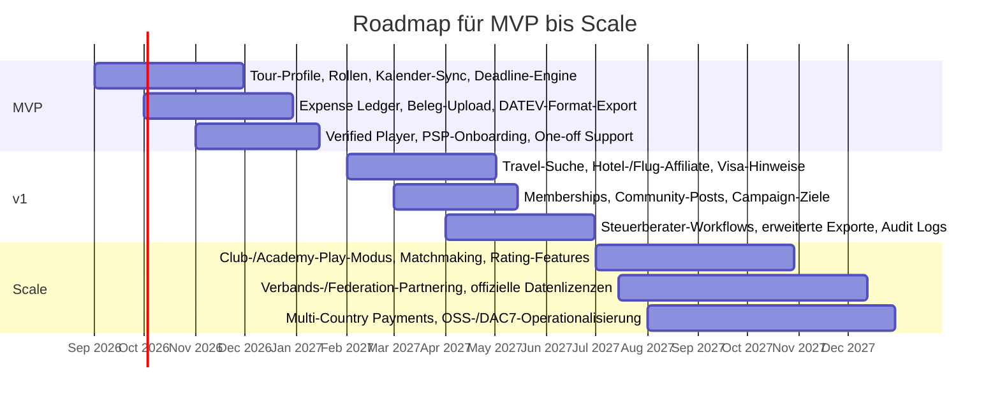

# Play, Tour und Fan-Support in einer Tennis-Webapp

## Executive Summary

Die Idee ist **strategisch stark**, aber nur dann, wenn sie **nicht** als „eine App für alles“ gebaut wird, sondern als **zwei klar getrennte Oberflächen auf derselben Plattform**: ein **Play-Modus** für Freizeit- und Vereinsspielerinnen und -spieler und ein **Tour-Modus** für Profis, Coaches, Eltern, Agenten und Support-Teams. Der Grund ist einfach: Heute sind die relevanten Profi-Workflows auf viele Systeme verteilt. ATP und ITF stellen offizielle Kalender, Entry-/Withdrawal-Prozesse, Acceptance Lists und Tour-Informationen bereit; Match- und Turnierdaten liegen in offiziellen Apps und Portalen; Trainings- und Teamkoordination laufen oft über generische Kalender oder Athlete-Management-Systeme; Reise, Visa und Buchhaltung liegen wieder in anderen Tools. Genau diese Fragmentierung ist die Marktchance. citeturn24search1turn42view1turn33search9turn6search1turn19search12turn19search3turn19search1turn19search2

Für den **Tour-Teil** ist die größte Lücke nicht „mehr Tennisdaten“, sondern ein **operatives Cockpit**, das Fristen, Reisen, Ausgaben und Teamrechte zusammendenkt. Die offiziellen Systeme leisten heute bereits Kernfunktionen: ATP regelt Entries und Withdrawals über Fristen und die PlayerZone; World Tennis Tour Zone bietet Kalender, Turnierinformationen, Entries, Withdrawals, Acceptance Lists, Notifications sowie Ranking- und WTN-Historie. Was fehlt, ist die Integration mit Travel, Finance, Dokumenten, Kalender-Sync und rollenbasierter Zusammenarbeit. Genau dort sollte ein neues Produkt ansetzen. citeturn24search1turn42view1turn33search9turn6search1turn19search1turn19search2

Das **Crowdfunding-/Support-Feature** ist ebenfalls attraktiv, aber nur in einer **sauberen rechtlichen Form**. Für Deutschland und die EU sollte die erste Version **kein Investment- oder Revenue-Share-Modell** sein. Sobald Fans wirtschaftliche Rechte, Darlehen oder Renditeerwartungen erhalten, kann die europäische Crowdfunding-Regulierung einschlägig werden; BaFin verweist für den Betrieb von Schwarmfinanzierungsplattformen auf die Verordnung (EU) 2020/1503. Für den MVP ist deshalb sinnvoller: **nicht steuerbegünstigte Fan-Unterstützung**, wiederkehrende Memberships, Zielkampagnen für Reisen/Turniere und optional perk-basierte Gegenleistungen wie Updates, Trainings-Blogs oder exklusive Community-Inhalte. citeturn30search0turn30search2turn30search5turn14search0

Technisch ist der beste Weg eine **plattformbasierte Zahlungsarchitektur mit lizenziertem PSP**, nicht eigene Verwahrung. Stripe Connect, Adyen for Platforms, Mangopay und Lemonway bieten genau den Plattform-/Marketplace-Zuschnitt: Onboarding, Identifizierung, Payouts und Gebührenlogik; Mangopay und Lemonway sind besonders crowdfunding- und wallet-nah, Stripe ist meist am schnellsten für ein MVP, Adyen sehr stark für Skalierung und komplexe Plattformmodelle. Wer dagegen selbst Geld für Dritte hält oder weiterleitet, rutscht schneller in Zahlungsdienste- und AML-Themen. citeturn16search0turn16search3turn16search7turn28search10turn17search8turn17search9turn26search1turn26search14turn11search0

Mein Gesamtfazit ist daher klar: **Ja, bauen – aber Tour-first, compliance-first und modular.** Der produktive Kern ist ein „Operating System für den Tennis-Alltag auf Tour“. Der Play-Bereich ist wichtig, aber eher als **Netzwerk- und Liquiditätsmotor** für Wachstum, Recruiting, Club-/Academy-Partnerschaften und spätere Conversion in Coaching, Camps, Support und Community. Der gefährlichste Fehler wäre, zu früh gleichzeitig Social Network, Travel-OTA, Payments-Plattform, Steuerprodukt und offizieller Tennisdatenanbieter sein zu wollen. Die richtige Reihenfolge ist: **Ops-Kern → Fan-Support → Travel/Finance-Automation → Play-Expansion**. citeturn18search0turn18search17turn20search13turn12search0turn8search0turn7search0turn32search0

## Annahmen und Untersuchungsrahmen

Für dieses Gutachten nehme ich an, dass der erste Produktmarkt **Deutschland beziehungsweise DACH mit EU-/UK-Reisefällen** ist, dass das Unternehmen **in Deutschland oder einem anderen EU-Staat** domiziliert wird, dass der erste Pro-Use-Case vor allem **ATP/Challenger/World-Tennis-Tour-Spieler** adressiert und dass der erste Buchhaltungs-/Steuerexport **DATEV-first** gedacht ist. Außerdem unterstelle ich, dass das Fan-Support-Feature im MVP **keine Wertpapier-, Kredit- oder Beteiligungsstruktur** hat, sondern als **Support/Membership/Perk-Modell** startet. Diese Annahmen sind wichtig, weil Zahlungsregulierung, Steuermeldungen, VAT/OSS, KYC und Datenhaltung stark vom Domizil und vom genauen Geldfluss abhängen. citeturn30search0turn30search5turn25search1turn20search13turn12search0

Methodisch basiert der Bericht auf **offiziellen Tennisquellen** von ATP, ITF beziehungsweise World Tennis, offiziellen europäischen und deutschen Quellen zu Steuer, Datenschutz, Zahlungs- und Crowdfunding-Regulierung sowie auf Primärdokumentation relevanter Infrastrukturpartner für Kalender, Travel, Payments und DATEV-Anbindung. Wo öffentliche offizielle APIs oder Verträge nicht offen dokumentiert sind, benenne ich das ausdrücklich als **Lizenzierungs- oder Partnering-Risiko** statt Annahmen als Fakten darzustellen. citeturn24search1turn33search9turn29search0turn29search7turn12search1turn13search6turn21search0turn18search0turn16search0turn20search1

## Heutige Abläufe und Schmerzpunkte

### Trainings- und Matchkalender

Im Profibereich existiert bereits ein Teil der Infrastruktur, aber sie ist **nicht in einem Arbeitsablauf vereint**. Auf der Turnierseite gibt es offizielle Kalender und Schedule-/Draw-Informationen über ATP und World Tennis. Die ATP/WTA-Live-App bewirbt Live Scores, offizielle Schedules, Stats und Rankings; World Tennis verweist auf World Tennis Tour Live sowie auf Tour Zone als zentrales Online-Service-Portal. Für High-Performance-Organisation und Teamkoordination setzen Sportorganisationen wiederum auf Kalender- und AMS-Lösungen: Teamworks beschreibt Shared Calendars und Scheduling für Training, Travel, Meals und weitere Termine; USTA nutzt Teamworks Hub & AMS als Athlete-Management-System. Dazu kommen die üblichen privaten Kalender über Google und Microsoft, deren APIs Shared Calendars, Events und Synchronisierung unterstützen. citeturn33search5turn33search1turn33search14turn33search2turn33search9turn19search3turn19search12turn19search1turn19search2

Das zentrale Problem ist deshalb nicht fehlende Information, sondern **fehlende Orchestrierung**. Der Spielplan kommt aus den Tours und Turnieren, die Trainingseinheiten aus Coach oder Academy, die Reise aus E-Mails und OTA-Buchungen, und Teammitglieder sehen selten denselben „Single Source of Truth“-Kalender. Für Profis mit Coach, Physio, Eltern, Agentur oder Steuerberatung steigt damit die Reibung in jedem Turnierblock. Die Webapp sollte gerade hier ansetzen: **importieren statt ersetzen**, also offizielle Tourtermine, Match-Schedules, Trainingsblöcke, Travel und Freigaben in einen einzigen rollenbasierten Kalender ziehen. Diese Empfehlung folgt direkt aus der heutigen Systemlandschaft der offiziellen Portale und AMS-/Kalendersysteme. citeturn33search9turn33search14turn19search3turn19search12turn19search1turn19search2

### Visa, Entry Deadlines und Benachrichtigungen

Bei den offiziellen Entry-Prozessen sind die Regeln klar, aber operativ anspruchsvoll. Der ATP-Regeltext nennt für ATP-Turniere bei Singles Main Draw eine Frist von **12 Uhr Eastern Time, 28 Tage vor Turniermontag**, für ATP-Tour-Qualifying **12 Uhr Eastern Time, 21 Tage vorher**; Entries und Withdrawals laufen über Player Relations, den Supervisor oder die **PlayerZone**. Im ATP-Regelwerk ist außerdem festgehalten, dass Spieler entered sein müssen, um durch Withdrawals ins Main Draw nachzurücken. Bei World Tennis Tour Zone heißt es ausdrücklich, dass das Portal — früher IPIN — **Kalender, Tournament Information, Entries, Withdrawals, Acceptance Lists, Player Resources & Notifications sowie Ranking- und WTN-Historie** bereitstellt. In den World-Tennis-Tour-Regulations sind für Singles typischerweise **18 Tage bis Entry Deadline** und **13 Tage bis Withdrawal Deadline** genannt; das Fact Sheet enthält unter anderem Hotelinformationen, Transport, Preisgeldabzüge und **Visa Contact**. citeturn24search1turn42view1turn44view0turn33search9turn6search1turn6search2

Parallel sind Visa- und Einreiseregeln ein bewegliches Ziel. Die EU-Kommission beschreibt für den Schengenraum die **90/180-Tage-Regel** und stellt einen offiziellen Short-Stay-Calculator bereit. Für das Vereinigte Königreich ist seit 2026 die **ETA** für bestimmte Reisende relevant; für die USA bleibt **ESTA** das offizielle System für das Visa Waiver Program. Daraus folgt ein offensichtlicher Produktbedarf: Eine Tour-Webapp darf Visa-Logik **nicht statisch in Code gießen**, sondern muss auf offizielle Regierungsquellen oder spezialisierte Travel-Compliance-Datenanbieter aufsetzen und visumrelevante Informationen mit Turnierorts- und Reiseplänen verknüpfen. citeturn22search0turn22search3turn22search1turn22search2turn22search8

### Ausgaben, Kategorien und Steuerexport

Auch die Finanzseite ist heute stark zersplittert. Für Belegdigitalisierung und Ausgabenerfassung sind am Markt spezialisierte Tools wie Pleo üblich; Pleo wirbt mit Receipt Scanning, OCR, automatischer Kategorisierung, Tax Codes und Export in Buchhaltungssysteme. Auf der deutschen Steuerberatungsseite ist DATEV der natürliche Anker: Das DATEV Developer Portal listet APIs, und DATEV dokumentiert weiterhin das **DATEV-Format** für Import/Export. Parallel gelten in Deutschland die GoBD als Rahmen für ordnungsmäßige digitale Aufbewahrung; das Bundesfinanzministerium hat die GoBD 2025 erneut angepasst, und für 2025 wurden die handels- und steuerrechtlichen Aufbewahrungsfristen für Buchungsbelege auf **acht Jahre** verkürzt. citeturn20search2turn20search8turn20search14turn20search17turn20search13turn20search1turn20search3turn13search6turn14search10

Die eigentliche Komplexität bei Profispielern ist jedoch **nicht nur Buchhaltung, sondern Quellenstaaten- und Turnierbezug**. Nach Artikel 17 des OECD-Musterabkommens können Einkünfte von Athleten grundsätzlich im **Staat der sportlichen Tätigkeit** besteuert werden. Für eine Tour-App bedeutet das: Ein sauberer Steuerexport braucht mindestens die Dimensionen **Land, Turnier, Leistungsart, Gegenpartei, Zahlungsweg, Währung und Belegstatus**. Eine App, die nur „Hotel“, „Flug“ und „Essen“ taggt, ist für einen international reisenden Profi operativ nützlich, aber steuerlich oft noch unzureichend. citeturn15search2turn20search8turn20search18turn20search3

### Verdichtete Ist-Analyse

| Bereich | Wie es heute typischerweise läuft | Offizielle/etablierte Quellen | Hauptschmerz |
|---|---|---|---|
| Turnier- und Matchplanung | Offizielle Tour-Kalender, Apps, Tour-Portale; manuelle Übertragung in private Kalender | ATP/WTA Live, ATP Scores/Draws, World Tennis Tour Live, Tour Zone citeturn33search5turn33search14turn33search0turn33search9 | Kein einheitlicher Teamkalender |
| Entries/Withdrawals | Fristen im Regelwerk; Aktionen über PlayerZone/Tour Zone | ATP Rulebook, World Tennis Tour Zone, WTT Regulations citeturn24search1turn42view1turn33search9turn6search1 | Fristen, Zeitzonen, Acceptance-Listen |
| Training/Support-Team | AMS und Kalender-Tools neben den Tour-Portalen | Teamworks, Google Calendar, Microsoft Graph citeturn19search3turn19search12turn19search1turn19search2 | Daten leben in Silos |
| Visa/Reise | Offizielle Regierungsseiten plus OTAs/Travel-Tools | EU Schengen, UK ETA, ESTA, Travel APIs citeturn22search0turn22search1turn22search2turn18search0turn18search17 | Regeln ändern sich; hoher manueller Aufwand |
| Spesen/Steuer | OCR-/Expense-Tool plus DATEV/Steuerberater | Pleo, DATEV, GoBD, OECD Art. 17 citeturn20search2turn20search8turn20search13turn13search6turn14search10turn15search2 | Grenzüberschreitende Steuerlogik fehlt |

## Zielbild und Best Practices für die Webapp

### Warum das Dual-Produkt-Modell sinnvoll sein kann

Der **Play-Bereich** und der **Tour-Bereich** bedienen unterschiedliche Jobs-to-be-done, können aber auf demselben Daten- und Identitätskern aufbauen. Im Freizeit- und Vereinssegment zeigen Angebote wie Playtomic oder tennis.de, dass Nutzer Court-Booking, Spielpartnersuche, Turnier-/Ligaorientierung, Statistiken und zentrale Accounts akzeptieren. Tennis.de bündelt inzwischen mehrere Services und macht aus unterschiedlichen DTB-/Landesverbandskanälen einen einheitlicheren Zugang; Playtomic kombiniert Court-Booking, Community und Match/Club-Erlebnisse. World Tennis Number wiederum ist eine globale Skala von 40 bis 1, die explizit dafür gedacht ist, passendere Matches zu ermöglichen. Das spricht dafür, dass eine gemeinsame Plattformbasis für Freizeit- und Leistungsfälle realistisch ist — **wenn die UX sauber getrennt bleibt**. citeturn8search0turn8search3turn8search12turn7search0turn7search2turn32search0turn32search5

Die Trennung der Oberflächen ist dabei entscheidend. „Play“ sollte sich wie ein Community-/Booking-/Matchmaking-Produkt anfühlen; „Tour“ wie ein Arbeitswerkzeug mit Deadlines, Dokumenten, Teamrechten, Travel und Finance. Ein gemeinsames Menü für beide Zielgruppen würde die Profiseite verwässern und die Freizeitseite überfrachten. Best Practice ist daher ein **Role-aware Product Shell**: dieselbe Identität, aber unterschiedliche Standardnavigation, andere Datenfreigaben und andere KPIs. Diese Architektur ist nicht nur UX-seitig vernünftig; sie ist auch compliance-seitig sauberer, weil öffentliche Social-Features, sensible Dokumente und Zahlungs-/KYC-Daten besser getrennt werden können. Die GDPR-Prinzipien der Zweckbindung und Datenminimierung sprechen genau für diese Trennung. citeturn21search0turn21search2turn21search6

### Empfohlene technische Architektur

Empfohlen ist eine **modulare Service-Architektur** mit gemeinsamem Identity- und Permission-Layer. Im Kern stehen:

- **Identity & Roles**: Spieler, Coach, Elternteil, Agent, Physio, Buchhalter, Fan, Club-Admin  
- **Tennis Data Layer**: offizielle Kalender, Draws, Rankings, Tour-Status, Player-Profile  
- **Calendar Orchestrator**: Google-/Outlook-Sync, Teamfreigaben, Reminder-Engine  
- **Travel & Compliance Layer**: Flight/Hotel-Suche, Buchungsstatus, Visa-/ETA-Hinweise  
- **Expense Ledger**: Belege, OCR, Freigaben, Kategorien, Kostenstellen, Export  
- **Payments & Support Layer**: KYC/KYB, Wallet/Payouts, Support-Kampagnen, Memberships  
- **Reporting Layer**: DATEV, CSV/API-Exports, DAC7-/Payout-Reports, Audit Logs  

Die öffentlich dokumentierten Travel-Optionen zeigen, dass diese Schichten als APIs verfügbar sind: Amadeus bietet Flight- und Hotel-APIs, Duffel Flight- und Travel-Booking-Workflows, Booking.com Demand API Zugang zu Reiseinventar für Affiliates. Für Kalender-Sync existieren robuste Primärschnittstellen von Google und Microsoft. Für Buchhaltung und Deutschland-first-Steuerkanzlei-Workflows ist DATEV das naheliegende Zielsystem. citeturn18search0turn18search3turn18search15turn18search4turn18search1turn18search10turn18search17turn19search1turn19search2turn20search1turn20search3

### Integrationsvergleich für MVP und spätere Skalierung

| Integrationsschicht | Option | Stärken | Grenzen | Empfehlung |
|---|---|---|---|---|
| Offizielle Tour-Operations | ATP PlayerZone / World Tennis Tour Zone | Offizielle Entries, Withdrawals, Lists, Notifications, Rankings/WTN-Historie citeturn42view1turn33search9turn6search1 | Öffentliche API-Dokumentation für Player-Workflows wurde in den gesichteten Quellen nicht offengelegt; hohes Partnering-/Lizenzrisiko | **Partnering first** statt Scraping |
| Offizielle Tennisdaten | ATP-eigene Inhalte / lizenzierte Daten über Sportradar | Offizielle Datenläufe und lizenzierte Materials existieren kommerziell citeturn29search0turn29search1 | ATP untersagt systematische Datenentnahme ohne Permission; Website-Inhalte sind nicht frei wiederverwendbar citeturn38view0turn38view2 | Für Public Data **Lizenzmodell** einplanen |
| Kalender | Google Calendar / Microsoft Graph | Shared Calendars, Events, Delegation, inkrementeller Sync citeturn19search1turn19search2turn19search4turn19search11 | Berechtigungsmanagement und Konfliktlogik liegen bei euch | **MVP-tauglich** |
| Travel | Amadeus / Duffel / Booking.com Demand API | Flight, Hotel, Stays, Buchungs- und Suchflows citeturn18search0turn18search3turn18search4turn18search1turn18search17 | Reisevertriebs- und Affiliate-Verträge nötig; kein „einfaches Widget“ | Für MVP eher **Such- und Deeplink-/Affiliate-first** |
| Accounting | DATEV Format / DATEV APIs | Deutschlandstauglich, Steuerkanzlei-kompatibel citeturn20search1turn20search3turn20search13 | DATEV tiefer zu integrieren ist organisatorisch anspruchsvoller als CSV-Export | **CSV/DATEV-Format zuerst**, API später |

### UX, Rechte und Verifikation

Im Tour-Modus braucht ihr **granulare Rollenrechte**. Google und Microsoft zeigen bereits auf API-Ebene, dass gemeinsame oder delegierte Kalender technisch normal sind; im Tenniskontext zeigen Teamworks und USTA, dass Multistakeholder-Koordination Standard ist. Daraus folgt: Coach darf Trainingsblöcke sehen und ändern, Eltern vielleicht nur Reise und Finanzen, Steuerberatung nur Spesen und Export, Fans ausschließlich öffentliche Inhalte und Support. Zusätzlich sollte jede sensible Änderung — Withdrawal-Hinweis, Visa-Dokument, Payout-Bankdaten, Steuerexport — in einem **Audit Log** laufen. citeturn19search2turn19search5turn19search3turn19search12

Für Verifikation ist ein **Stufenmodell** am sinnvollsten:

| Verifikationsstufe | Wie sie funktioniert | Vorteile | Nachteile | Geeignet für |
|---|---|---|---|---|
| PSP-KYC/KYB | Identitätsprüfung durch Payment-Partner mit Dokumenten, Liveness, Screening citeturn16search11turn16search14turn26search0turn26search18 | Compliance-nah, direkt für Payouts nutzbar | Nicht automatisch „echter Tennisprofi“ | Auszahlungen und Support |
| Deutscher Online-Ausweis / eID | Sichere Online-Identifikation über Online-Ausweis/AusweisApp citeturn27search0turn27search1turn27search22 | Hohe Vertrauensstufe, starker Fraud-Check | Länderabhängig, nicht global | Deutschland-first Onboarding |
| Manuelle Dokumentenprüfung | Upload von ATP-/World-Tennis-Nachweisen, Verbandsbestätigung, Belegen | Flexibel bei Sonderfällen | Operativ teuer, langsamer | Ausnahmefälle |
| Tennis-spezifischer Statusabgleich | Abgleich mit offiziellen Player-Profilen, Tour Zone / World Tennis ID / ATP-Profilen citeturn24search5turn33search13turn33search9 | Hoher Community-Trust, guter Badge-Use-Case | Meist nur mit Partnering oder Nutzerzustimmung belastbar | „Verified Player“-Badge |

Die Empfehlung ist, **KYC und Sportstatus zu trennen**. Ein KYC-verifizierter Account darf ausgezahlt werden; ein **Verified Player**-Badge setzt zusätzlich Sportnachweise voraus. So verhindert ihr, dass „rechtlich auszahlbar“ fälschlich als „sportlich authentisch“ wahrgenommen wird.

## Crowdfunding und Fan-Support für niedriger gerankte Pros

### Produktlogik und sinnvoller Startpunkt

Für Spieler weit außerhalb der ATP-Top-250 ist das Support-Thema substanziell. Die ATP-Baseline-Logik adressiert Mindestabsicherung nur für die **Top 250**; 2025 profitierten 30 Spieler von insgesamt 2 Millionen US-Dollar, mit garantierten Schwellen nach Rankingband. Challenger-Prize-Money steigt zwar weiter stark, ebenso existieren Grand-Slam-Player-Grants über die ITF beziehungsweise World Tennis, aber diese Programme bleiben selektiv. Ein Spieler auf Rang um 1500 fällt regelmäßig **außerhalb** solcher Sicherheitsnetze. Daher ist Fan-Support kein „nice to have“, sondern kann wirtschaftlich plausibel sein — gerade wenn Reisen, Qualis und kleinere ITF-Events finanziert werden müssen. citeturn34search0turn34search1turn34search4turn34search5

Das beste erste Modell ist **Support plus Membership**, nicht Finanzanlage. Konkret:

- Einmalige Unterstützung für saisonale oder turnierbezogene Ziele  
- Wiederkehrende Mitgliedschaft für Fans  
- Tilted Rewards wie Updates, Behind-the-scenes, private Posts, Match-Recs, Q&A  
- Transparente Zweckbindung: „M15 Antalya Woche“, „Visum + Flug“, „Coach-Hotel“, „Physio-Block“  

Damit bleibt ihr in einer Creator-/Support-Logik, ähnlich den Mechaniken von GoFundMe, Patreon oder Ko-fi, statt in eine regulierte Investment-Crowdfunding-Logik zu rutschen. Patreon arbeitet mit wiederkehrenden Memberships und prozentualen Plattformgebühren; Ko-fi mit 0–5-%-Logik je nach Nutzungsmodell; GoFundMe mit 0 EUR Start-/Plattformgebühr für Fundraiser und Transaktionsgebühren. Diese Modelle sind für Fan-Support vertraut und UX-seitig gut verstehbar. citeturn23search0turn23search1turn23search4turn23search2turn23search11

### Recht, Steuern und Meldungen

Der wichtigste Punkt in Deutschland: Zahlungen an einen einzelnen Profi sind **regelmäßig keine steuerbegünstigten Spenden** im Sinne klassischer Gemeinnützigkeit. Das Bundesfinanzministerium erklärt steuerbegünstigte Spenden im Zusammenhang mit gemeinnützigen Vereinen, Kirchen und anderen steuerbegünstigten Empfängern; daraus folgt, dass Fan-Support an eine einzelne Spielerin oder einen einzelnen Spieler **nicht als abziehbare Spende vermarktet werden sollte**. Die UI und Terms müssen das unmissverständlich ausdrücken. citeturn14search0turn14search9

Steuerlich kann Support je nach Ausgestaltung unterschiedlich einzuordnen sein. **Reine Zuwendungen ohne Gegenleistung** können schenkungsteuerlich relevant sein; für nicht nahestehende Personen nennt § 16 ErbStG Freibeträge von **20.000 Euro** in den Steuerklassen II und III. **Support mit Gegenleistung** — zum Beispiel Coaching-Calls, exklusive Inhalte, signierte Waren, Clinics oder Appearance-Leistungen — rückt näher an Einkünfte aus Leistungen und kann einkommen- und umsatzsteuerliche Folgen haben. Genau deshalb sollte das Produkt intern strikt unterscheiden zwischen **gift-like support**, **membership/content** und **personal services**. citeturn36view1turn36view2turn25search5turn25search11

Außerdem ist DAC7 zu beachten: Die Europäische Kommission stellt klar, dass Plattformbetreiber meldepflichtig sein können und dass der Anwendungsbereich unter anderem **personal services**, goods, rentals of transport und property rentals umfasst. Eine Plattform, die Fans Coaching, Clinics oder andere persönliche Leistungen von Spielern buchen lässt, bewegt sich also deutlich näher an DAC7-relevanter Tätigkeit als eine reine freiwillige Unterstützung ohne Gegenleistung. Deutschland setzt dies über das Plattformen-Steuertransparenzgesetz um und das BZSt betreibt dafür Registrierung und FAQ-Strukturen. citeturn39view0turn12search0turn12search1turn12search2

Und noch wichtiger: Sobald ihr nicht mehr bloß Support oder Creator-Membership, sondern **Darlehen, Revenue Share, Tokenisierung oder Gewinnbeteiligung** anbietet, kann die europäische Crowdfunding-Regulierung relevant werden. Die Europäische Kommission beschreibt die ECSP-Verordnung ausdrücklich für lending- und investment-based business crowdfunding; BaFin verweist für den Betrieb einer Schwarmfinanzierungsplattform genau auf diese Verordnung. Für euren Use Case ist daher die sauberste Product Rule: **MVP ohne Renditeversprechen und ohne wirtschaftliche Beteiligungsrechte**. citeturn30search0turn30search2turn30search5

### Zahlungsanbieter, KYC/AML und Restriktionen

Für das Support-Feature würde ich **kein eigenes Money-Movement-Modell** bauen. Stattdessen sollte die Plattform mit einem PSP / Zahlungsinstitut arbeiten, das Onboarding, KYC, Wallets, Payouts, Limits und Screening bereitstellt. Stripe Connect spricht Marktplätze und Plattformen explizit an und nennt Onboarding, Gebühreneinzug und Payouts; Adyen for Platforms nennt ausdrücklich Peer-to-peer-Marketplaces, On-demand- und Crowdfunding-Plattformen; Mangopay und Lemonway positionieren sich noch klarer im Marketplace-/Crowdfunding-/Wallet-Kontext. citeturn16search0turn28search9turn16search7turn31search16turn17search8turn17search9turn26search1turn26search14

Diese Anbieter unterscheiden sich aber in Reichweite und Profil. Stripe ist stark in schneller Produktivsetzung und breiter Developer-Adoption; Adyen ist besonders stark bei globalem Scale und tiefer Plattforminfrastruktur; Mangopay und Lemonway passen gut, wenn ihr echte **multi-party flows** und crowdfunding-nahe Wallet-/Payout-Muster in Europa wollt. Gleichzeitig zeigen offizielle Dokus, dass Länderverfügbarkeit, Cross-Border-Payouts und Restrictions variieren: Stripe nennt 46+ Länder und zusätzliche Cross-Border-Payout-Möglichkeiten; Adyen listet konkrete Plattformländer in Europa, Nordamerika und APAC; Mangopay dokumentiert Country Restrictions; Lemonway ist als europäisches Payment Institute für Marketplaces und Crowdfunding positioniert. citeturn28search9turn28search18turn28search10turn28search1turn28search2turn26search14

| Anbieter | Offizieller Fit | Was er besonders gut kann | Relevante Einschränkung | Geeignet für |
|---|---|---|---|---|
| Stripe Connect | Marketplaces/Platforms, Onboarding, Fees, Cross-border Payouts citeturn16search0turn16search3turn28search9turn31search0 | Schnellstes MVP, gute DX, Embedded/Hosted Onboarding | Länder-/Feature-Matrix beachten | **MVP** |
| Adyen for Platforms | Plattformen inkl. Crowdfunding; End-to-end Payments + Payouts citeturn16search7turn31search16turn28search10 | Starke Skalierung, Reporting, Multiregion | Häufig enterprise-lastiger Go-live | **Scale** |
| Mangopay | Wallet-basierte Multi-party-Flows; Marketplace/Crowdfunding-Nähe citeturn17search8turn17search9turn31search2turn31search5 | Wallets, flexible Fee-Logik, Europa-Fokus | Crowdfunding teils „restricted“ mit Zusatzanforderungen citeturn17search6 | **EU-Support-Plattform** |
| Lemonway | Marketplace- und Crowdfunding-Zahlungen, ACPR-reguliert citeturn26search1turn26search14turn26search21 | KYC/KYB, Crowdfunding-Erfahrung, Europa | Weniger „plug-and-play“ als Stripe | **Crowdfunding-nahe Setups** |

### Trust- und Fraud-Design

Das Support-Feature steht und fällt mit Vertrauen. Gute Praxis wäre:

- **Verified Player**-Badge erst nach KYC **und** Tennis-Status  
- **öffentliche Nachweise**: offizielle Player-Profile, Turnierhistorie, Ranking-Referenz, Kampagnenzweck  
- **Payout Delays/Reserves** für neue Accounts und auffällige Muster  
- **Zweckgebundene Kampagnen** statt reinem „Gib Geld“-CTA  
- **Chargeback-/Dispute-Management** über PSP  
- **Minors excluded** im MVP  
- **Keine Aussagen wie „steuerlich absetzbar“**, sofern nicht über gemeinnützige Strukturen gelöst  
- **Sichtbare Transparenz**: eingegangene Beträge, Plattformgebühr, Auszahlungsstatus, Verifikationsstatus  

Mangopay, Lemonway und Stripe dokumentieren KYC-/Onboarding- und Restriktionsmechanismen; der Datenschutzrahmen der EU verlangt zugleich Zweckbindung und Datenminimierung. Deshalb sollte die Plattform z. B. Visa-Passkopien oder Wohnsitznachweise **nicht** einfach für Community-Zwecke zurückverwenden. Verifikation ja; Datensparsamkeit ebenso. citeturn16search11turn16search14turn26search0turn26search18turn28search2turn21search0turn21search2turn21search8

### Sinnvolle Erlösmodelle

| Modell | Marktlogik | Beispiel / Referenz | Eignung für euer Produkt |
|---|---|---|---|
| 0% Plattformfee, nur Payment-Fees/Tip-Modell | Niedrige Einstiegshürde, hohe Conversion | GoFundMe: keine Fee zum Start/Management, Transaktionsgebühr pro Donation citeturn23search0turn23search6 | Gut für einzelne Kampagnen, schwächer planbar |
| Fixe Prozentgebühr auf Support | Transparent, planbar | Ko-fi: 0–5% je Modell + Processor Fees citeturn23search2turn23search11turn23search14 | Sehr gut für MVP |
| Membership-/Creator-Fee | Wiederkehrender Umsatz | Patreon: 5–12% bzw. Standard 10% je Struktur citeturn23search1turn23search4turn23search10 | Gut für Fan-Communitys |
| Hybrid | SaaS im Tour-Modus + niedrige Support-Fee im Fan-Modus | Eigene Struktur; unterstützt B2B2C | **Am überzeugendsten** |

Meine klare Empfehlung ist ein **Hybridmodell**:  
**Tour:** Subscription pro Spieler oder Team.  
**Support:** niedrige Prozentgebühr auf eingehende Unterstützungen.  
**Play:** Club-/Academy-/Event-Fees, später Booking-Kommissionen.  

Das reduziert die Abhängigkeit von Donor-Volumen und macht den Tour-Kern wirtschaftlich eigenständig.

## Wirtschaftlichkeit, KPIs und Go-to-Market

### Was zuerst gebaut werden sollte

Die Go-to-Market-Logik sollte **Tour-first** sein. Warum? Weil die Pain Points dort spitzer und zahlungsbereiter sind. Lower-tier-Pros, Eltern-finanzierte Nachwuchs-/Transition-Spieler, Coaches, kleine Akademien und nationale Verbände leben schon heute in einer Welt aus Tour-Portalen, Travel, Deadlines, Kalendern und Belegen. ATP, World Tennis und Teamworks zeigen, dass es für Schedule und Performance bereits Spezialbausteine gibt; eine App, die diese Bausteine operativ zusammenführt, hat einen klareren Payback als eine weitere generische Community-App. Dagegen ist der Freizeitmarkt größer, aber deutlich härter umkämpft und viel stärker von lokaler Liquidität abhängig. citeturn24search1turn33search9turn19search12turn7search0turn8search0

Deshalb lautet die beste Reihenfolge:

1. **Tour-Ops-Kern**: Deadlines, Kalender, Travel, Spesen, Teamrechte  
2. **Support-Layer**: Verified Player, One-off Support, Memberships, Payouts  
3. **DATEV-/Steuerexport**: Deutschland-first  
4. **Play-Expansion**: Matchmaking, Club-Integrationen, Events, Social Layer  

So wächst das Produkt aus einem harten Profi-Workflow in ein größeres Consumer-Ökosystem hinein, statt umgekehrt.

### KPI-Set für Produkt und Betrieb

Ein sinnvolles KPI-Set wäre:

| KPI | Warum er zählt |
|---|---|
| Anteil der Spieler mit mindestens einem verbundenen Kalender | Misst Workflow-Einbettung |
| Anteil der Turnierwochen mit vollständigem Reise- und Fristenstatus | Misst operative Nutzung |
| Verpasste Entry-/Withdrawal-Deadlines pro 100 aktive Spieler | Wichtigster Outcome-KPI im Tour-Modus |
| Belegabdeckungsquote und Auto-Kategorisierungsquote | Misst Finance-Automation |
| Tage bis Monatsabschluss / Export an Steuerberatung | Direkter ROI |
| Verifizierte Spielerquote | Trust-Grundlage für Support |
| Support-GMV pro aktivem Profi | Monetarisierungs-Kern |
| Donor-Repeat-Rate und Campaign Completion Rate | Community-Qualität |
| Chargeback- und Fraud-Rate | Risikoindikator |
| Aktivierte Club-/Academy-Partner im Play-Modus | GTM-Skalierung |

### Größte Go-to-Market-Risiken und Gegenmaßnahmen

| Risiko | Warum es ernst ist | Gegenmaßnahme |
|---|---|---|
| Zu breiter Scope | Travel, Finance, Social, Support und Tourdaten sind jeweils eigene Produkte | Strikte Phasenreihenfolge |
| Fehlender offizieller Datenzugang | ATP-Inhalte und systematische Datennutzung sind lizenzsensibel citeturn29search0turn38view2 | Partnering/Lizenzierung früh klären |
| Payment-/Compliance-Überforderung | Support-Funktion kann schnell AML/KYC/DAC7/Crowdfunding-Regeln triggern citeturn39view0turn30search5 | PSP-first, MVP ohne Renditeversprechen |
| Steuerkomplexität | Athletensteuerung ist grenzüberschreitend und turnierbezogen citeturn15search2 | Export- und Dokumentationsprodukt, kein „Tax Engine“-Versprechen im MVP |
| Zu wenig Liquidität im Play-Modus | Matchmaking lebt von Dichte | Clubs, Akademien und Verbände als Distribution |
| Vertrauensproblem bei Fan-Support | Fake-Spieler, missbräuchliche Kampagnen, zweifelhafte Mittelverwendung | Verifikation, Audit, transparente Payout-Logik |

### Roadmap von MVP zu Scale

## Fazit

Das überzeugendste Produkt ist **kein Tennis-Social-Network mit ein paar Profi-Extras**, sondern ein **Tour-Betriebssystem mit einem angebockten Community- und Support-Layer**. Die heutige Realität spricht stark dafür: ATP und World Tennis decken offizielle Turnier-/Entry-Workflows ab, aber Travel, Teamkalender, Visa-Compliance, Ausgaben und steuerfeste Exporte bleiben fragmentiert. Genau diese Lücke kann eine Webapp schließen. citeturn24search1turn33search9turn19search1turn19search2turn20search13

Der **Play-Modus** ist trotzdem strategisch wichtig, aber eher als **Zubringer**: Er erhöht Reichweite, Community, Club-/Academy-Partnerschaften und später die Fan- und Coaching-Monetarisierung. Er sollte auf derselben Plattform laufen, aber mit eigener Navigation, eigenem Permissions-Modell und eigener KPI-Logik. Das ist sowohl produktseitig als auch datenschutzrechtlich sauberer. citeturn7search0turn8search0turn21search2turn21search6

Das **Fan-Support-Feature** ist aus meiner Sicht wirtschaftlich und strategisch besonders stark, weil es genau dort ansetzt, wo offizielle Schutzmechanismen nur begrenzt greifen: jenseits der Top-250. Aber es muss von Anfang an richtig gebaut werden: **keine steuerbegünstigte „Spende“ versprechen, keine Investment-Logik im MVP, kein eigenes Verwahrmodell**, sondern PSP-basiertes KYC/Payout-Setup, transparenter Zweck, klare Gebühren, scharfe Verifikation und saubere Meldelogik. citeturn34search0turn14search0turn30search0turn16search0turn17search8

Wenn ich die Entscheidung auf einen Satz verdichten müsste, dann wäre es dieser: **Baut zuerst das beste operative Tool für den Alltag auf Tour — und lasst Community und Support organisch darum wachsen.** Das ist die realistischste, differenzierendste und regulatorisch vernünftigste Version dieser Idee.